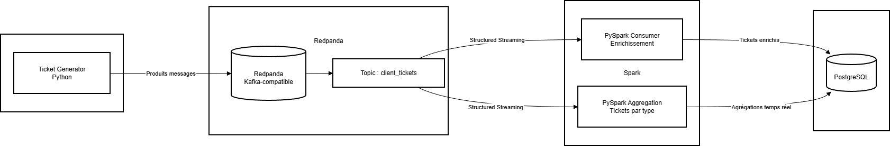

# 📊 POC – Gestion de tickets clients avec Redpanda et PySpark

## Contexte

Dans le cadre de l’exercice 2, InduTech souhaite réaliser un **POC (Proof Of Concept)** afin de démontrer la mise en place d’un **pipeline de données temps réel** pour la gestion de tickets clients.

Les tickets sont générés en continu, ingérés via **Redpanda (Kafka-compatible)**, puis consommés et analysés **en temps réel avec PySpark Structured Streaming**.

Ce projet simule une architecture moderne orientée streaming, telle qu’elle pourrait être déployée dans un environnement cloud (AWS).

---

## Objectifs du projet

- Configurer un cluster **Redpanda** pour l’ingestion de données temps réel  
- Produire des tickets clients aléatoires via un **script Python**  
- Consommer et transformer ces données avec **PySpark Structured Streaming**  
- Générer des **insights temps réel** (enrichissements et agrégations)  
- Persister les résultats dans une base relationnelle (**PostgreSQL**)  
- Orchestrer l’ensemble avec **Docker Compose**

---

## Données manipulées

Chaque ticket client contient les champs suivants :

- `ticket_id` : identifiant unique du ticket  
- `client_id` : identifiant du client  
- `created_at` : date et heure de création  
- `request` : description de la demande  
- `type` : type de demande (`incident`, `demande`, `question`)  
- `priority` : priorité (`low`, `medium`, `high`)  

---

## Architecture du pipeline



### Flux global

1. Génération de tickets clients en continu (Producer Python)
2. Publication des tickets dans un topic Kafka (**Redpanda**)
3. Consommation temps réel par **PySpark Structured Streaming**
4. Deux traitements parallèles :
   - Enrichissement métier des tickets
   - Agrégation temps réel (nombre de tickets par type)
5. Persistance dans **PostgreSQL**
6. Visualisation et supervision via **Redpanda Console** et **Spark UI**

---

## Description des composants

### 🔹 Redpanda
- Broker Kafka-compatible
- Réception des tickets en temps réel
- Topic principal : `client_tickets`
- Accessible sur le port **9092**
- Supervision via **Redpanda Console**

---

### 🔹 Producer (Python)
- Génère des tickets clients aléatoires en continu
- Envoie les messages JSON dans le topic `client_tickets`
- Implémenté en Python avec une librairie Kafka
- Simule une source applicative temps réel

---

### 🔹 Spark Consumer (Enrichissement)
- Lecture du topic Kafka via **Structured Streaming**
- Parsing des messages JSON
- Enrichissement métier :
  - `incident` → **Support Technique**
  - `demande` → **Customer Care**
  - `question` → **Support Information**
- Affichage des tickets enrichis en console
- Persistance dans PostgreSQL (table `tickets`)

---

### 🔹 Spark Consumer Aggregation
- Traitement d’agrégation temps réel
- Calcul du **nombre de tickets par type**
- Mise à jour à chaque micro-batch
- Résultats persistés dans PostgreSQL (table `tickets_aggregation`)

---

### 🔹 PostgreSQL
- Stockage relationnel utilisé pour le POC
- Centralise :
  - les tickets enrichis
  - les agrégations temps réel
- Utilisé comme base opérationnelle (non analytique)

---

### 🔹 Redpanda Console
- Interface web de supervision Kafka
- Visualisation :
  - topics
  - messages
  - partitions
- Accessible via : **http://localhost:8080**

> ⚠️ Les consumer groups Spark peuvent ne pas apparaître comme des consumers Kafka classiques, car **Spark Structured Streaming gère les offsets via ses checkpoints internes**.

---

## Lancement du projet

### Prérequis
- Docker
- Docker Compose
- Environnement Linux / **WSL recommandé**

### Commande de démarrage

```
docker compose up --build
```

## Services démarrés

- Redpanda
- Redpanda Console
- Producer de tickets
- Spark Consumer (enrichissement)
- Spark Consumer Aggregation
- PostgreSQL

---

## Accès aux interfaces

### Redpanda Console
http://localhost:8080

### Spark UI

- Consumer : http://localhost:4040
- Aggregation : http://localhost:4041

### PostgreSQL

- Accès via `psql` ou un client graphique (PgAdmin, DBeaver, etc.)

---

## Résultats observables

- Flux de tickets affichés en temps réel dans les logs Spark
- Tickets enrichis persistés en base PostgreSQL
- Agrégations mises à jour à chaque micro-batch
- Messages visibles dans Redpanda Console
- Pipeline stable et fonctionnel en continu

---

## Technologies utilisées

- Python 3
- Redpanda (Kafka-compatible)
- Apache Spark 3.4 – Structured Streaming
- PostgreSQL
- Kafka API
- Docker & Docker Compose

---

## Limites et perspectives

### Limites

- PostgreSQL utilisé uniquement à des fins de démonstration
- Checkpoints Spark locaux (POC)
- Pas de supervision avancée (metrics / alerting)

### Perspectives

- Stockage analytique (Parquet, Delta Lake, S3)
- Externalisation des checkpoints Spark
- Dashboards (Grafana, Superset)
- Scalabilité horizontale :
  - augmentation des partitions Kafka
  - ajout d’executors Spark
- Déploiement cloud (AWS MSK / EKS)

---

## Démonstration vidéo

Une courte vidéo de démonstration accompagne ce projet :  
https://www.loom.com/share/3aedb1d4046a4cd084f1950a2c872f61

---

## Conclusion

Ce POC démontre la mise en place complète d’un pipeline de streaming temps réel, depuis la génération des données jusqu’à leur analyse et leur persistance, en s’appuyant sur des technologies modernes utilisées en production.
